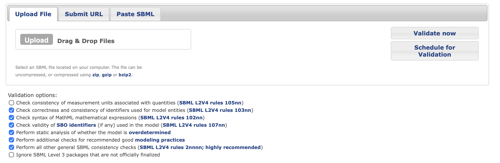
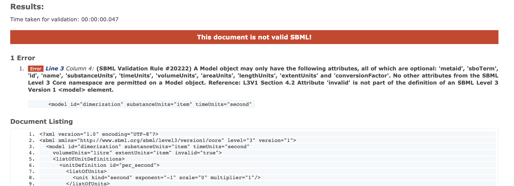

## Vue3 SBML-Validator

This projects hosts a reusable vue component for the validation
of SBML files. It uses the precompiled emscripten library 
`./lib/sbml_validator.js` that once instantiated as module, exposes one function `instance.validateSBMLString(data)` that validates
a utf-8 data string and returns a dictionary like: 

```json
[
  { "line": 3, "message": "A Model object may only have the following attributes, all of which are optional: 'metaid', 'sboTerm', 'id', 'name', 'substanceUnits', 'timeUnits', 'volumeUnits', 'areaUnits', 'lengthUnits', 'extentUnits' and 'conversionFactor'. No other attributes from the SBML Level 3 Core namespace are permitted on a Model object. Reference: L3V1 Section 4.2  Attribute 'invalid' is not part of the definition of an SBML Level 3 Version 1 <model> element. ", "severity": "error" }
]

```

with all errors. 

### Old validator

This component replaces the old validator, in which one could upload sbml files by pasting SBML, or uploading files, or pointing to URLS: 



specifying a couple of options. After validation the results would be displayed like so:

* status valid | warning | invalid
* list of errors with except of the reported line, with link to full document below
* listing of all lines of the SBML file

