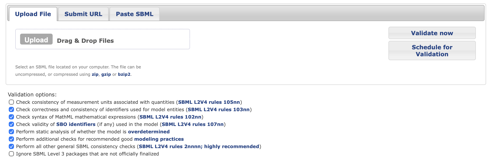
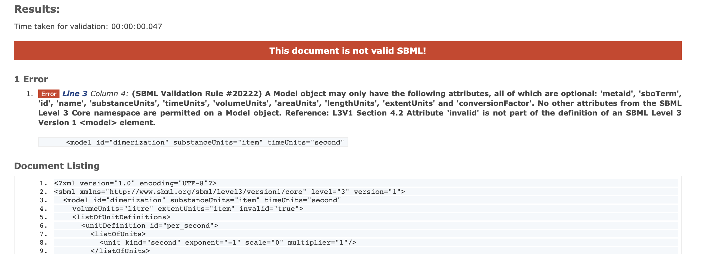

## Vue3 SBML-Validator

This projects hosts a reusable vue component for the validation
of SBML files. It uses the precompiled emscripten library 
`./lib/sbml_validator.js` that once instantiated as module, exposes one function `instance.validateSBMLString(data)` that validates
a utf-8 data string and returns a dictionary like: 

```json
[
    {
      "line": 3,
      "column": 4,
      "message": "A Model object may only have the following attributes, all of which are optional: 'metaid', 'sboTerm', 'id', 'name', 'substanceUnits', 'timeUnits', 'volumeUnits', 'areaUnits', 'lengthUnits', 'extentUnits' and 'conversionFactor'. No other attributes from the SBML Level 3 Core namespace are permitted on a Model object. Reference: L3V1 Section 4.2  Attribute 'invalid' is not part of the definition of an SBML Level 3 Version 1 <model> element. ",
      "severity": "error",
      "category": "SBML component consistency",
      "errorId": 20222,
      "package": "core"
    }
]

```

with all errors. 

### Installation

1. **Clone the repository** (or add it as a dependency / submodule):

   ```bash
   git clone https://github.com/sbmlteam/vue3-sbml-validator
   cd vue3-sbml-validator
   ```

2. **Install dependencies:**

   ```bash
   npm install
   ```

3. **Run the development server:**

   ```bash
   npm run dev
   ```

   Then open the URL shown in the terminal (typically `http://localhost:5173`).

4. **Build for production:**

   ```bash
   npm run build
   ```

   Output goes to `dist/`. Use `npm run preview` to serve the built app locally.

**Note:** The validator relies on the precompiled Emscripten library in `./lib/sbml_validator.js` (and any associated `.wasm` files). Ensure the `lib/` directory is present and served correctly when running or deploying the app.


### Old validator

This component replaces the old validator, in which one could upload sbml files by pasting SBML, or uploading files, or pointing to URLS: 



specifying a couple of options. After validation the results would be displayed like so:

* status valid | warning | invalid
* list of errors with except of the reported line, with link to full document below
* listing of all lines of the SBML file




<h2> vue3-sbml-validate\README.md<h2>
<details>

<summary>
<h3>Subdirectories with links to the relevant README </h3> 
</summary>

- [\docs](./docs/README.md)
- [\example_files](./example_files/README.md)
- [\lib](./lib/README.md)
- [\public](./public/README.md)
- [\src](./src/README.md)

</details>

<details>

<summary>
<h3>Files </h3> 
</summary>

| File Name | Type | Description |
|----------|------|-------------|
| CITATION.cff | Citation File Format | citation file for this project |
| LICENSE | - | License file for the application |
| index.html | HTML | the main file for displaying the web page |
| package.json | JSON | file for determining the package and any dependencies necessary |
| vite.config.js | JavaScript | file necessary for giving the configuration to built this into the existing sbml.org structure |

</details>

